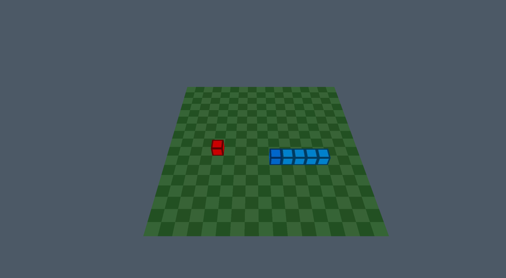

# **SNAKE GL**
#### GitHub repo: https://github.com/ADOGamedev/SnakeGL

#### Description: This is an application made in C++ via OpenGL using GLAD. It's just the famous Snake game but in 3D. I did this to practice OpenGL.

## Controls

- **WASD**: turn upwards, left, downwards or right, respectively.
> [!NOTE]
> When you reach the border, you wrap to the other side like Pac-Man

## Screenshots

